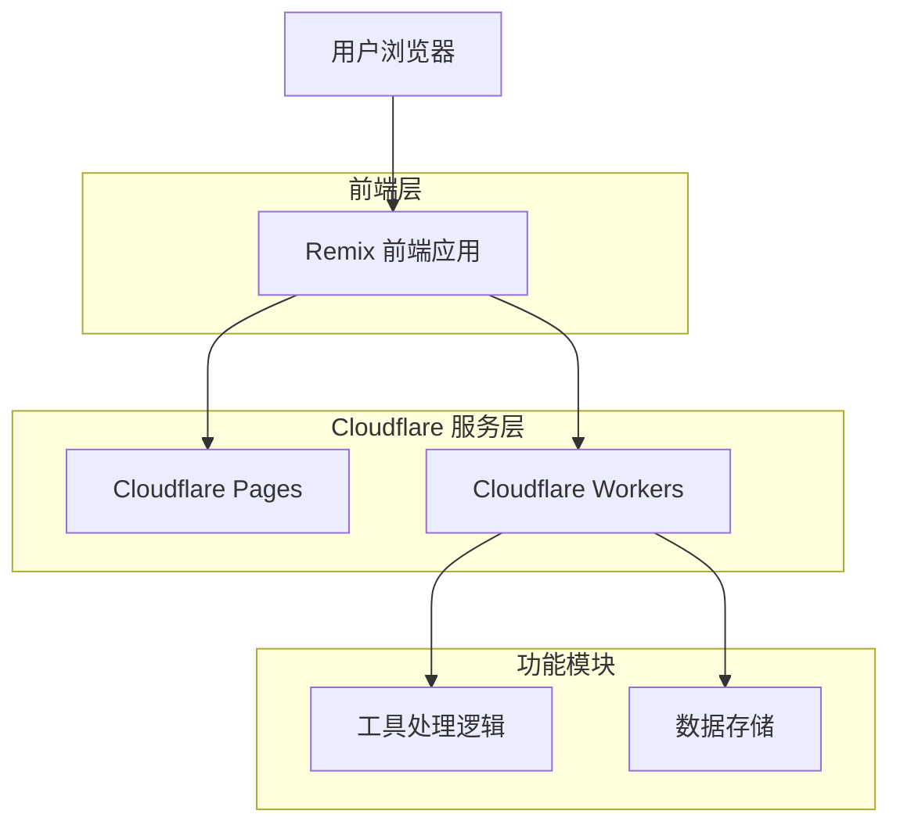
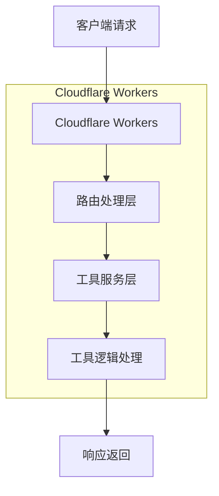

## 1. 架构设计



## 2. 技术描述

* **前端框架**: Remix\@2 + React\@18 + TypeScript

* **样式框架**: Tailwind CSS\@3

* **部署平台**: Cloudflare Pages (前端) + Cloudflare Workers (后端逻辑)

* **初始化工具**: create-remix\@latest (Cloudflare Pages 模板)

* **构建工具**: Vite (内置于 Remix)

* **包管理器**: pnpm

## 3. 路由定义

| 路由                    | 用途          |
| --------------------- | ----------- |
| /                     | 首页，展示所有工具入口 |
| /tools/api-debugger   | API调试工具页面   |
| /tools/code-formatter | 代码格式化工具页面   |
| /tools/qr-generator   | 二维码生成器页面    |
| /settings             | 用户设置页面      |
| /api/tools/\*         | 工具API接口路由   |

## 4. API 定义

### 4.1 工具API

**API调试工具**

```
POST /api/tools/api-debugger
```

请求参数：

| 参数名     | 参数类型   | 是否必需 | 描述                              |
| ------- | ------ | ---- | ------------------------------- |
| method  | string | 是    | HTTP方法 (GET, POST, PUT, DELETE) |
| url     | string | 是    | 请求URL                           |
| headers | object | 否    | 请求头对象                           |
| body    | string | 否    | 请求体                             |

响应参数：

| 参数名     | 参数类型   | 描述        |
| ------- | ------ | --------- |
| status  | number | 响应状态码     |
| headers | object | 响应头对象     |
| data    | any    | 响应数据      |
| error   | string | 错误信息（如果有） |

**代码格式化工具**

```
POST /api/tools/code-formatter
```

请求参数：

| 参数名      | 参数类型   | 是否必需 | 描述     |
| -------- | ------ | ---- | ------ |
| code     | string | 是    | 待格式化代码 |
| language | string | 是    | 编程语言类型 |

响应参数：

| 参数名           | 参数类型   | 描述        |
| ------------- | ------ | --------- |
| formattedCode | string | 格式化后的代码   |
| error         | string | 错误信息（如果有） |

**二维码生成器**

```
POST /api/tools/qr-generator
```

请求参数：

| 参数名     | 参数类型   | 是否必需 | 描述               |
| ------- | ------ | ---- | ---------------- |
| content | string | 是    | 二维码内容            |
| size    | number | 否    | 二维码尺寸（默认200）     |
| color   | string | 否    | 二维码颜色（默认#000000） |

响应参数：

| 参数名    | 参数类型   | 描述             |
| ------ | ------ | -------------- |
| qrCode | string | Base64格式的二维码图片 |
| error  | string | 错误信息（如果有）      |

## 5. 服务器架构



## 6. 数据模型

由于第一阶段工具主要为纯前端处理，无需持久化存储用户数据。后续阶段可考虑添加用户系统时实现数据存储。

## 7. 项目结构

```
build-better/
├── app/
│   ├── components/          # 可复用组件
│   │   ├── ui/             # 基础UI组件
│   │   ├── tools/          # 工具相关组件
│   │   └── layout/         # 布局组件
│   ├── routes/             # 页面路由
│   │   ├── _index.tsx      # 首页
│   │   ├── tools/          # 工具页面
│   │   │   ├── api-debugger.tsx
│   │   │   ├── code-formatter.tsx
│   │   │   └── qr-generator.tsx
│   │   └── settings.tsx    # 设置页面
│   ├── styles/             # 样式文件
│   ├── utils/              # 工具函数
│   └── api/                # API处理逻辑
├── public/                 # 静态资源
├── worker/                 # Cloudflare Workers
├── package.json
├── remix.config.js
├── tailwind.config.js
├── tsconfig.json
└── wrangler.toml          # Cloudflare 配置
```

## 8. 开发规范

### 8.1 代码规范

* 使用 TypeScript 进行开发

* 遵循 ESLint 和 Prettier 配置

* 组件采用函数式组件和 Hooks

* 使用语义化的 HTML 标签

### 8.2 文件命名

* 组件文件使用 PascalCase (如: ApiDebugger.tsx)

* 工具函数使用 camelCase (如: formatCode.ts)

* 路由文件使用 kebab-case (如: api-debugger.tsx)

### 8.3 性能优化

* 使用 Remix 的 data loading 和 caching 机制

* 实现组件级别的代码分割

* 优化图片和资源加载

* 使用 Cloudflare 的边缘缓存

## 9. 部署配置

### 9.1 Cloudflare Pages 配置

```toml
# wrangler.toml
name = "build-better"
main = "worker/index.js"
compatibility_date = "2024-01-01"

[build]
command = "npm run build"
```

### 9.2 构建脚本

```json
{
  "scripts": {
    "build": "remix build",
    "dev": "remix dev",
    "deploy": "npm run build && wrangler publish"
  }
}
```

## 10. 监控和扩展

### 10.1 监控指标

* 页面加载时间

* API响应时间

* 错误率统计

* 用户使用频率

### 10.2 扩展点

* 支持更多编程语言的代码格式化

* 添加用户登录和个性化设置

* 实现工具使用历史记录

* 支持自定义工具开发

