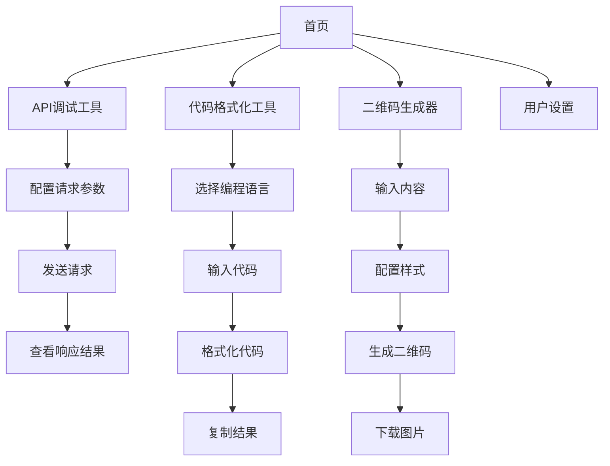

## 1. 产品概述
Build Better 是一个基于 Cloudflare 全栈技术构建的微工具集合网站，旨在为开发者提供便捷实用的在线工具。网站采用响应式设计，支持各种设备访问，提供简洁明了的用户界面。

目标用户群体：前端开发者、后端开发者、全栈工程师、技术爱好者。
产品价值：通过集成常用开发工具，提高开发效率，减少工具切换成本。

## 2. 核心功能

### 2.1 用户角色
| 角色 | 注册方式 | 核心权限 |
|------|----------|----------|
| 访客用户 | 无需注册 | 使用所有基础工具功能 |
| 注册用户 | 邮箱注册 | 保存工具使用历史、收藏常用工具 |

### 2.2 功能模块
Build Better 网站包含以下核心页面：
1. **首页**：工具分类导航、热门工具展示、搜索功能
2. **API调试工具页**：请求方法选择、参数输入、响应展示
3. **代码格式化工具页**：语言选择、代码输入、格式化输出
4. **二维码生成器页**：内容输入、样式配置、二维码生成
5. **用户设置页**：个人信息管理、历史记录查看

### 2.3 页面详情
| 页面名称 | 模块名称 | 功能描述 |
|----------|----------|----------|
| 首页 | 导航栏 | 显示网站Logo、工具分类菜单、搜索框 |
| 首页 | 工具展示区 | 以卡片形式展示各工具图标和简介 |
| 首页 | 页脚 | 显示版权信息、使用说明、联系方式 |
| API调试工具页 | 请求配置区 | 选择HTTP方法(GET/POST/PUT/DELETE)、输入URL、设置请求头 |
| API调试工具页 | 参数输入区 | 输入请求参数、支持JSON格式编辑 |
| API调试工具页 | 响应展示区 | 显示响应状态码、响应头、响应体 |
| 代码格式化工具页 | 语言选择器 | 选择编程语言(JavaScript/TypeScript/HTML/CSS/JSON) |
| 代码格式化工具页 | 代码编辑器 | 输入待格式化代码、支持语法高亮 |
| 代码格式化工具页 | 格式化结果 | 显示格式化后的代码、支持一键复制 |
| 二维码生成器页 | 内容输入区 | 输入文本、URL等内容 |
| 二维码生成器页 | 样式配置 | 设置二维码尺寸、颜色、边距 |
| 二维码生成器页 | 生成预览 | 实时显示生成的二维码、支持下载 |
| 用户设置页 | 个人信息 | 显示和编辑用户基本信息 |
| 用户设置页 | 历史记录 | 查看工具使用历史记录 |

## 3. 核心流程

### 访客用户使用流程
1. 访问首页 → 浏览工具列表 → 选择所需工具
2. 使用API调试工具 → 配置请求参数 → 发送请求 → 查看响应结果
3. 使用代码格式化工具 → 输入代码 → 选择语言 → 格式化 → 复制结果
4. 使用二维码生成器 → 输入内容 → 配置样式 → 生成 → 下载二维码

### 注册用户使用流程
1. 注册登录 → 进入用户设置 → 管理个人信息
2. 使用工具时 → 系统自动保存使用历史 → 可随时查看历史记录
3. 收藏常用工具 → 在首页快速访问收藏的工具

## 4. 用户界面设计

### 4.1 设计风格
- **主色调**：蓝色系 (#3B82F6) 作为主色，灰色系 (#6B7280) 作为辅助色
- **按钮样式**：圆角矩形设计，悬停效果，主要操作为实心按钮
- **字体选择**：系统字体优先，标题使用粗体，正文字号14-16px
- **布局风格**：卡片式布局，顶部固定导航栏，内容区域居中显示
- **图标风格**：使用简洁的线条图标，保持视觉一致性

### 4.2 页面设计概览
| 页面名称 | 模块名称 | UI元素 |
|----------|----------|--------|
| 首页 | 导航栏 | 左侧Logo，中间工具分类下拉菜单，右侧搜索框，背景白色，底部阴影 |
| 首页 | 工具展示区 | 网格布局展示工具卡片，每张卡片包含图标、标题、简短描述，悬停时有轻微上浮效果 |
| API调试工具页 | 请求配置区 | 顶部横向排列方法选择器、URL输入框、发送按钮，使用蓝色主题色 |
| API调试工具页 | 参数输入区 | 左侧JSON编辑器，支持语法高亮，右侧可折叠的请求头设置面板 |
| 代码格式化工具页 | 编辑器区域 | 左右分栏布局，左侧输入原始代码，右侧显示格式化结果，中间有转换按钮 |
| 二维码生成器页 | 配置面板 | 左侧输入内容和样式配置，右侧实时显示生成的二维码，支持拖拽调整大小 |

### 4.3 响应式设计
- **桌面端优先**：默认设计为桌面端最佳体验
- **移动端适配**：768px以下屏幕自动切换为单列布局
- **平板适配**：768px-1024px范围内采用双列布局
- **触摸优化**：移动端增大按钮点击区域，支持滑动操作

### 4.4 性能优化
- **懒加载**：工具页面按需加载，减少初始加载时间
- **缓存策略**：静态资源设置长期缓存，API响应根据内容设置合理缓存
- **代码分割**：按工具模块进行代码分割，提高页面加载速度
- **图片优化**：二维码等生成图片采用最优格式和压缩率